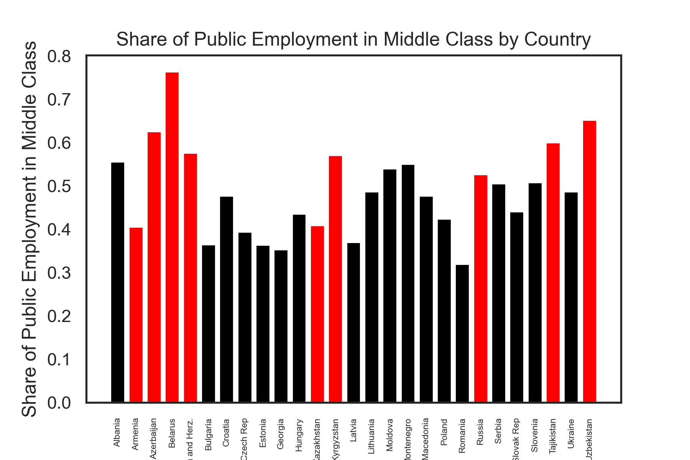
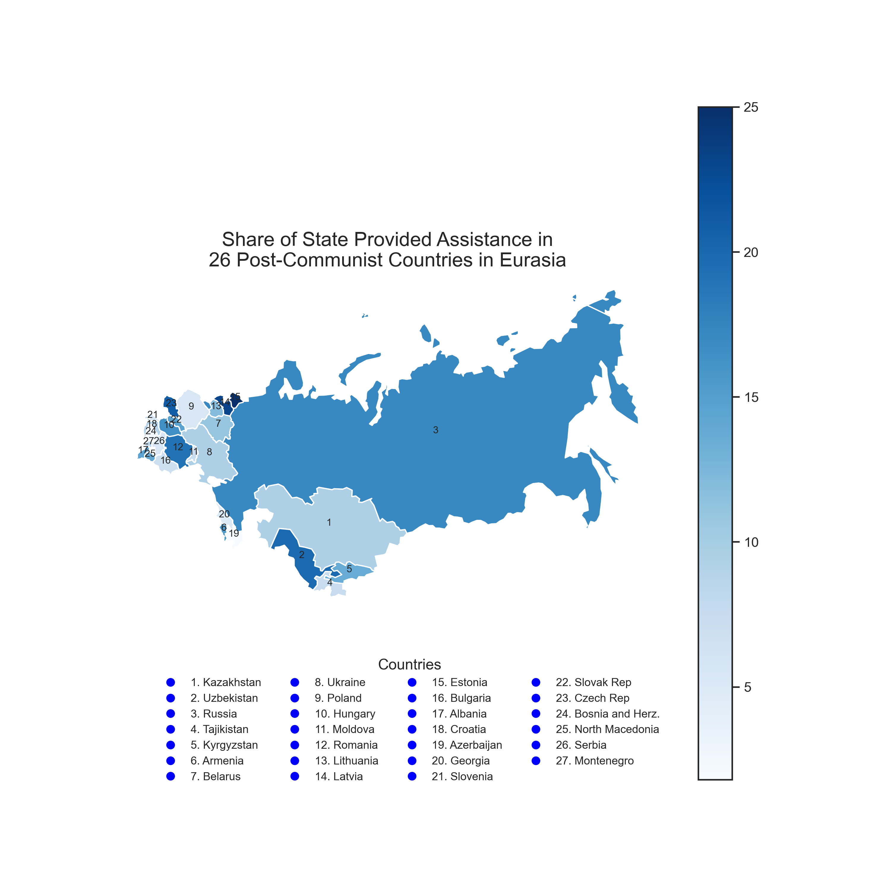
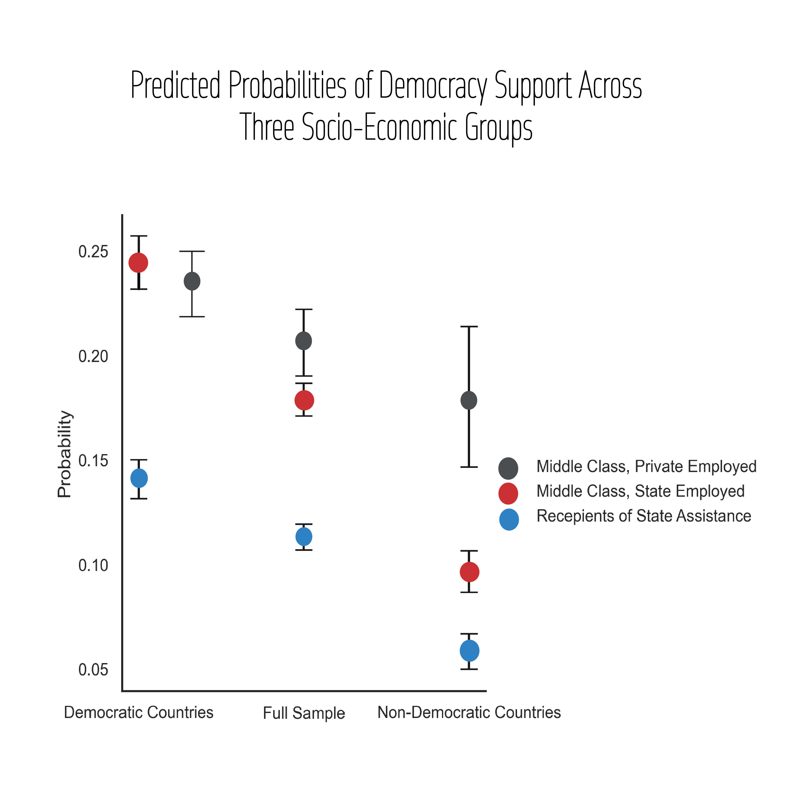

# Exploring the Influence of State Dependency on Regime Preferences in Post-Communist Europe and Central Asia
## Summary
In this research project, I replicate and extend the analysis presented in the book Autocratic Middle Class (Rosenfeld, 2020),  which investigates the influence of state dependency on the demand for democracy in post-communist Europe and Eurasia. My focus is on the book's third chapter, which offers a cross-national examination of the regime preferences of the post-communist middle class. By replicating the author's study, I demonstrate that the middle class's demand for democracy is more contingent than previously believed, with increased support for democracy observed only among those employed in the private sector in non-democratic states. Furthermore, I expand the scope of analysis to include individuals exhibiting the greatest reliance on the state, such as those receiving unemployment and disability benefits, social assistance, and welfare transfers. My findings indicate that among various socio-economic groups, those receiving state assistance are the least likely to support democracy as a regime, thereby providing a deeper understanding of the relationship between state dependency and democratic preferences.
## Data
In this study, I utilize data from the European Bank for Reconstruction and Development's (EBRD) Life in Transition Survey (European Bank for Reconstruction and Development. (2006). Life in Transition Survey (LiTS). Retrieved from https://rb.gy/51rgv), conducted in early 2006. The dataset comprises nearly 27,000 individual observations across 27 countries from Central and Eastern Europe and the former Soviet Union. This unique dataset includes information on both employment history and regime preferences.

For the purpose of our analysis, I divide the data into two sub-samples: democratic countries 
(N = 18) and non-democratic countries (N = 9). The democratic countries in the sample include Albania, Bulgaria, Croatia, Czech Republic, Estonia, Georgia, Hungary, Latvia, Lithuania, Macedonia, Moldova, Montenegro, Poland, Romania, Serbia, Slovak Republic, Slovenia, and Ukraine. Non-democratic countries consist of Azerbaijan, Armenia, Belarus, Kazakhstan, Kyrgyzstan, Russia, Tajikistan, and Uzbekistan.

While the original study's author does not explicitly state the index or method used for classifying the countries, my research indicates that the classification aligns with the Economist Intelligence Unit's Democracy Index (Economist Intelligence Unit. (2006). Democracy Index. Retrieved from https://rb.gy/8t1h1). The democratic sub-sample encompasses full democracies and flawed democracies, while the non-democratic sub-sample includes hybrid and authoritarian regimes. Notably, Georgia and Ukraine were classified as hybrid regimes by the Economist Democracy Index in 2006. However, the author acknowledges that these countries were on the cusp of democracy and includes them in the democratic sub-sample; I follow the same approach in my analysis.

## Model and Variables
This study aims to explain regime preferences across 27 countries, focusing on the relationship between socio-economic dependency on state and support for democracy.

Dependent variable - democracy: I measure democracy using two components. The first component, 'democracysupport', captures the preference for democracy through a survey question that asks respondents which statement they agree with most: (1) Democracy is preferable to any other form of the political system; (2) For people like me, it does not matter whether a government is democratic or authoritarian; or (3) Under some circumstances, an authoritarian government may be preferable to a democratic one. I code 'democracysupport' as one for those who believe democracy is preferable and zero otherwise.

The second component, 'instsupport', measures respondents' beliefs regarding the importance of various democratic institutions, including: (1) free and fair elections, (2) freedom of speech, (3) an independent press, (4) courts that defend individual rights against abuse by the state, (5) equality before the law, (6) minority rights, and (7) a strong political opposition. I code 'instsupport' as one for those who strongly believe that all of the aforementioned institutions are important.

The dependent variable 'democracy' is a product of 'democracysupport' and 'instsupport'. Later, I relaxed the definition of democracy to include individuals who “somewhat agree” that the above-metntioned institutions are important.

Independent Variable - Middle Class: To define the middle class, I identifying middle-class individuals as upper or lower-level managers, professionals, or small-business owners who have graduated from a four-year college or university

Independent Variable - State Employment: I code 'state employment' as one for individuals employed in the state sector and zero otherwise. Additionally, I create sub-groups of state employment, including state-employed educators, health professionals, and administrators to explore differences in regime preferences for seperate groups.

Independent Variable - State Assistance: I code 'state assistance' as one for individuals who received state-provided benefits, such as unemployment allowance, social assistance, and disability benefits, and zero otherwise.

Control Variables: to account for differences in regime preferences across age groups, I include age and age squared as control variables. Additionally, I control for gender to account for any potential differences in regime preferences or state employment.

## Output Files

This project requires running five main scripts and two additional scripts. The five main scripts are responsible for data cleaning, defining variables of interest, creating visualizations, and performing regression. The two additional scripts are used to generate an alternative (relaxed) definition of democracy and conduct the corresponding regression analysis. If you are interested in exploring results for rigid refinition of democracy, you DO NOT need to run two additional scripts. 

Five main scripts:

[PreparingDataForRegression.py](./PreparingDataForRegression.py): This code performs several tasks on the LITS2006 dataset. The main objectives are to clean, preprocess, and transform the dataset for further analysis. The code consists of the following steps:

- Merging original CSV files: The code reads four separate CSV files (LITS2006_1.csv, LITS2006_2.csv, LITS2006_3.csv, and LITS2006_5.csv), stores them as Pandas DataFrames, and merges them based on their common index column.
- Preprocessing the data: The code sets the 'countryname' column as the index of the merged DataFrame, filters out Turkey and Mongolia, and explores the data to get a sense of its structure.
- Building new dataset: The code creates a new DataFrame and generates dependent, independent, and control variables to be used in future analyses. These variables include state employment, state assistance, democracy support, middle class, age, gender, expenditures, and more.
- Creating interaction term: The code creates an interaction term between middle class and state employment, which can be used for regression analysis.
- Saving the cleaned data: The cleaned and transformed dataset is saved as a CSV file [Cleaned Dataset 2006](cleaned_dataset2006.csv) with the 'countryname' as the index label.

[StateEmploymentAndAssistance2006.py](./StateEmploymentAndAssistance2006.py): This code analyzes and visualizes employment, state assistance, and middle-class employment trends in post-communist countries using the LITS2006 dataset.

The code performs the following tasks:

- Imports the necessary libraries, including numpy, pandas, seaborn, and matplotlib.
- Loads the dataset, capitalize country names, and correct specific country names using a replacement dictionary.
- Calculates the share of public employment per country, and save the result as a CSV file, [state_employment_perc.csv](state_employment_perc.csv)
- Calculates the average percentage of public employment in democratic and non-democratic countries, and create a bar chart to visualize the comparison.
- Calculates the percentage of the sample that depends on state-provided assistance, and save the result as a CSV file, [state_assistance_perc.csv](state_assistance_perc.csv)
- Creates a scatter plot to visualize the relationship between state employment share and state assistance share in post-communist Europe and calculates the share of public employment in the middle class for each country, and compare the average share between democratic and non-democratic countries.

[MapOfStateEmployement_2006.py](./MapOfStateEmployement_2006.py) and [MapOfStateAssistance2006.py](./MapOfStateAssistance2006.py): Two Python scripts that visualize the share of state-provided assistance and public employment in post-communist countries in Europe and Central Asia. The data is represented using heatmaps based on geographical boundaries of the countries. The heatmaps are generated using the GeoPandas, Pandas, and Matplotlib libraries.

- Heatmap_map_assistance.py: this script reads a CSV file state_assistance_perc.csv, which contains the share of state-provided assistance for each country. The script then loads a shapefile of world countries using GeoPandas and selects only the countries of interest. The countries are then projected onto a Lambert Conformal Conic projection to fit all the countries in the right position on the map. The share of state-provided assistance is then merged with the shapefile, and a heatmap is created using the 'Blues' colormap.
- Heatmap_Emp.py: this script is similar to the first one, but instead, it reads a CSV file state_employment_perc.csv, which contains the share of public employment for each country. The script then follows the same process as the first one: loading the shapefile, selecting countries of interest, projecting the map, and merging the data. A heatmap is created using the 'Reds' colormap to represent the share of public employment.

[LogisticRegression2006.py](./LogisticRegression2006.py): This code is a Python script that imports necessary libraries, loads a cleaned dataset, and performs logistic regression to predict the probability of being in a democracy based on several factors. The factors include employment status, middle class status, state assistance, age, and gender.

- The script first prepares the data by filtering relevant columns and creating interaction terms. It then runs logistic regression on the full sample, which includes both democratic and non-democratic countries. The script calculates predicted probabilities for three different scenarios: middle class and privately employed, middle class and state-employed, and recipients of state assistance.

- Next, the code perfroms the same steps on two sub-samples: democratic and non democratic countries and calculatess rpedicted probabilities for supporting democracy. 

- Finally, the script uses the seaborn and matplotlib libraries to create a scatterplot with error bars. This plot displays the predicted probabilities of supporting democracy for different socio-economic scenarios.

**Note**: Detailed comments on building logistic regression model, fitting on the data and displaying marginal effects are available in the script file.

Two alternative scripts are [AlternativeDefinitionofDemocracy.py](Regression_Alternative_Definiton_Democracy/AlternativeDefinitionofDemocracy.py) and [AlternativeDemocracy_Regression.py](Regression_Alternative_Definiton_Democracy/AlternativeDemocracy_Regression.py). The first scipt changes the definition of democracy to include individuals who 'shomewhat' agree that democratic institutions are important and produces alternative csv file, called

## Results

Following the collapse of the Soviet Union and the subsequent transformation of communist regimes in European countries, free market economies and private businesses began to emerge and develop. However, even 15 years after the dissolution of the Soviet Union, the state remained a significant employer in many of these countries. 

The figure one presents the average percentage of public employment in democratic and non-democratic countries in 2006. The data reveals that public employment constituted approximately 42% of total employment in democratic countries, compared to nearly 60% in non-democratic countries. The Figure two shows share of public employment in all 27 countries.

Among non-democratic countries, Azerbaijan, Belarus, and Uzbekistan exhibited the highest shares of public employment at 75%, 74%, and 63%, respectively. In contrast, the Czech Republic, Hungary, and Latvia demonstrated the lowest shares at 30%, 31.5%, and 33%, respectively. Notably, Georgia and Ukraine, classified as on the verge of democracy in early 2006, displayed relatively higher shares of public employment at 58.5% and 51%, respectively, compared to other democratic countries.

The middle class holds significant importance in the economic and political development of a nation. In post-communist countries, understanding the relationship between the middle class and the state is crucial, as public employment still remained a primary avenue for individuals seeking to attain social and economic status 15 years after the Soviet Union's collapse. 

The data presented in the figure three highlights that the middle class relies heavily on public employment in both democratic and non-democratic post-communist countries. However, this dependency is more pronounced in autocratic nations. For instance, in Belarus, almost one in every eight middle-class individuals works in the public sector. On average, one in every six middle-class citizens is employed by the state sector in non-democratic countries. In comparison, the proportion of middle-class individuals employed by the public sector is relatively lower in democracies, with approximately 40% of the middle class working in this sector.

Figure 4 displays the proportion of state assistance recipients in all 27 post-communist countries. These individuals rely on welfare, disability benefits, and social assistance from the state. Although this group represents relatively small portion of the overall population, it is most dependent on the state.  In non-democratic countries, 69% of state assistance recipients depend solely on state-provided financial aid as their only income source. Additionally, they are less likely to own land, a dwelling, or a car.

Figure 5 presents the predicted probabilities of democracy support across three socio-economic groups, based on the logistic regression analysis. In democratic countries, the middle class displays higher support for democracy, irrespective of the sector. However, in non-democratic nations, the positive effect on democracy support weakens among the middle class reliant on the autocratic state. Notably, the private-sector middle class exhibits a substantially higher likelihood of supporting democracy compared to their public-sector counterparts. State assistance recipients demonstrate lower support for democracy in both non-democratic and democratic samples. This effect is markedly more pronounced in non-democratic countries, where the probability of supporting democracy is drastically lower compared to democracies.

